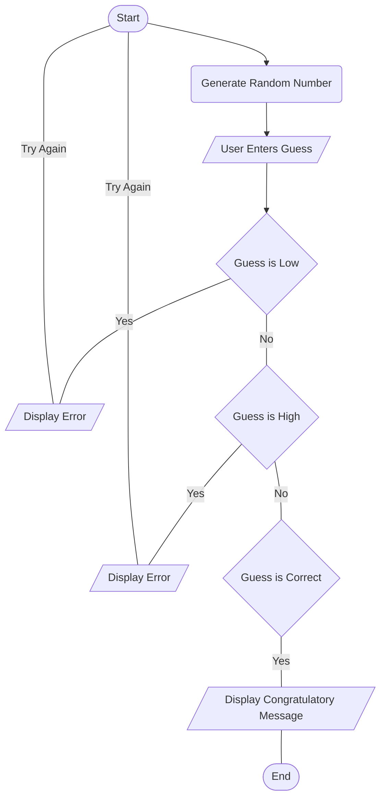

I started my flowchart with the starting node and connected it to the "Generate Random Number" node, which I assigned the letter “B”. I connected the “B” node to the “C” node, which I named "User Enters Guess." Next, I connected the “C” node to the “D” node, which I called "Guess is Low." I linked “B” to a new variable “E” "Display Error”, and I linked the arrow with the text "Yes." I created a new node “F” "Guess is High," which is linked to the “D” node with an arrow linked with the text "No." I connected the “F” node to the “G” node, which was a duplicate of the “F” node, with the arrow linked with the text "Yes". Subsequently, I connected the “F” node to a new “H” node which is named "Guess is Correct" and linked the arrow with the text "No." I next linked the “H” node to a new I node named, "Display Congratulatory Message,” and the arrow was linked with the text "Yes." Penultimately, I linked both the “E” and “G” nodes to the Start node with both arrows were linked with the text "Try Again." Finally, I created the end node and linked the “I” node to it.  
