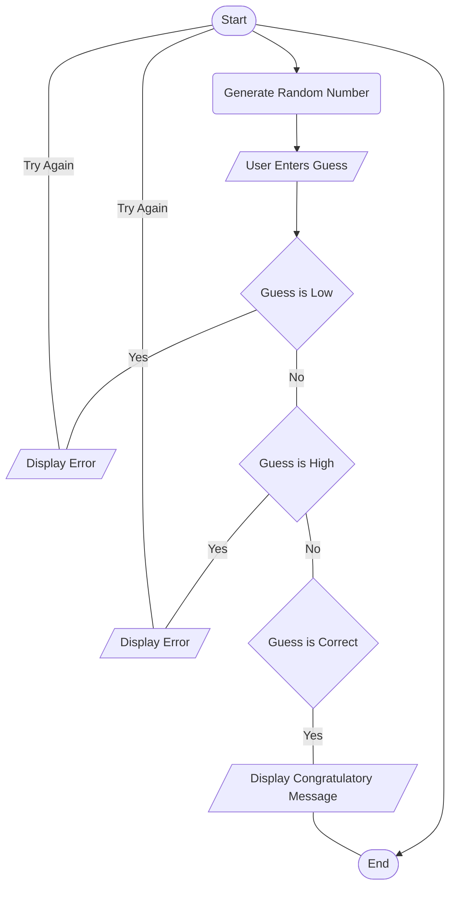

```mermaid 
flowchart TD
    Start([Start]) --> End([End]) 
    Start([Start]) --> B(Generate Random Number)
    B --> C[/User Enters Guess/]
    C -->D{Guess is Low}
    E[/Display Error/]
    D---|Yes|E
    F{Guess is High}
    D---|No|F
    G[/Display Error/]
    F---|Yes|G
    F---|No|H
    H{Guess is Correct}
    I[/Display Congratulatory Message/]
    H---|Yes|I 
    E---|Try Again|Start 
    G---|Try Again|Start 
    I---End
``` 
